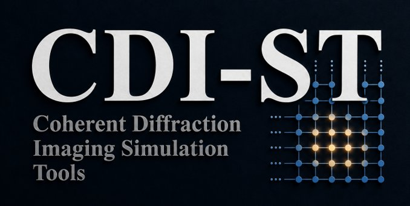
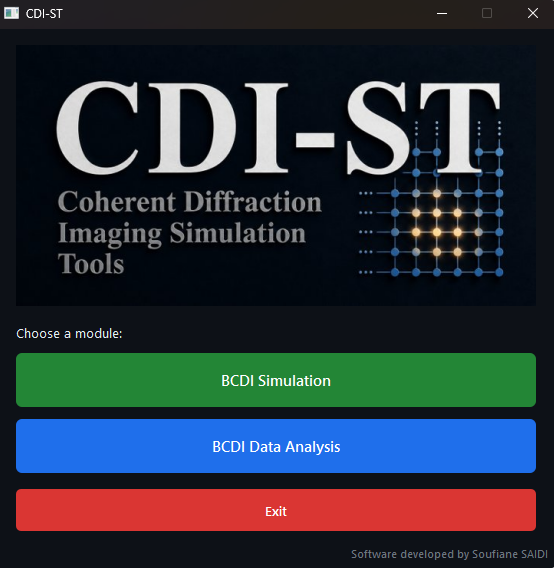
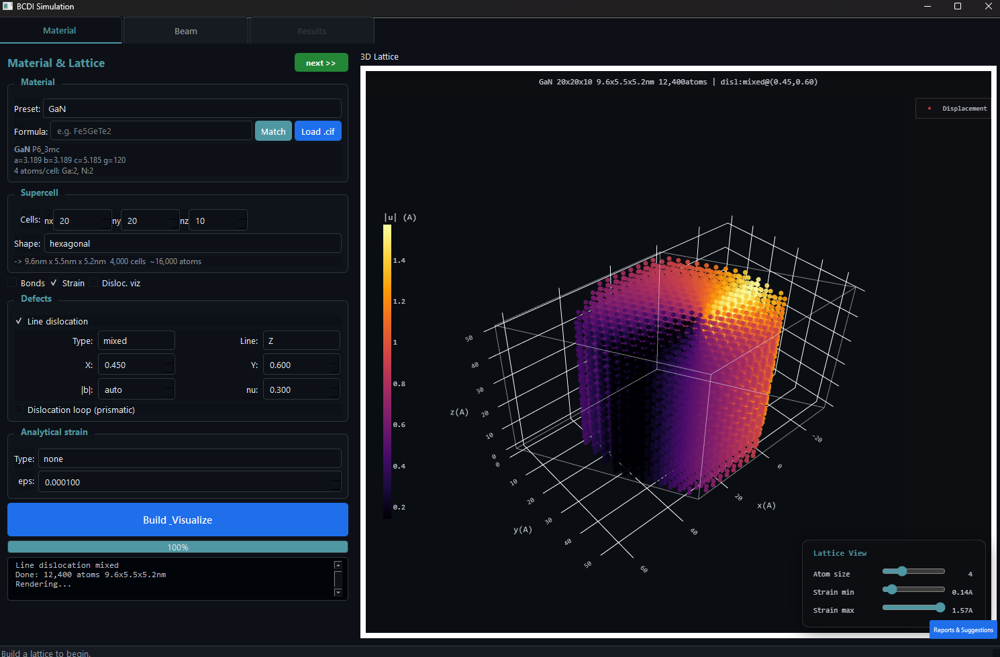
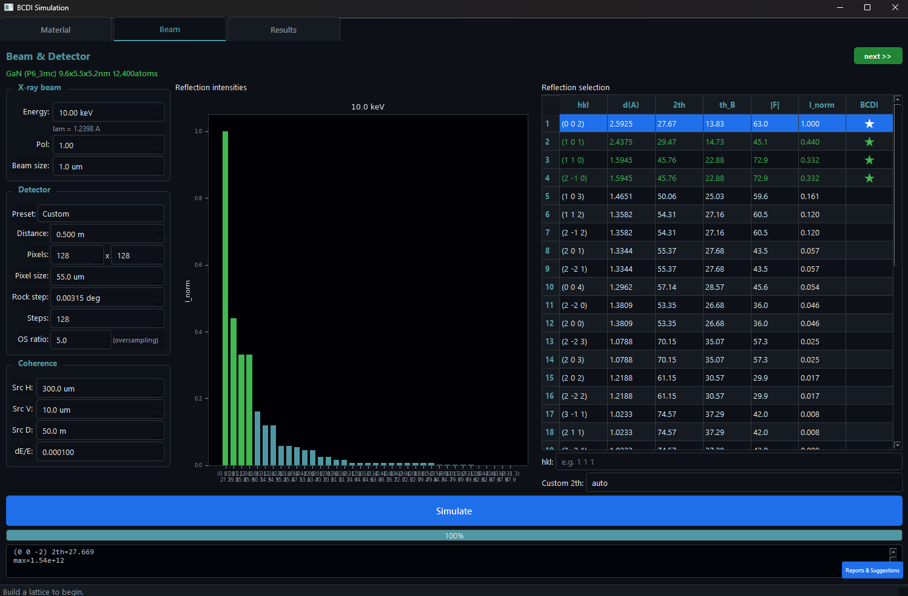
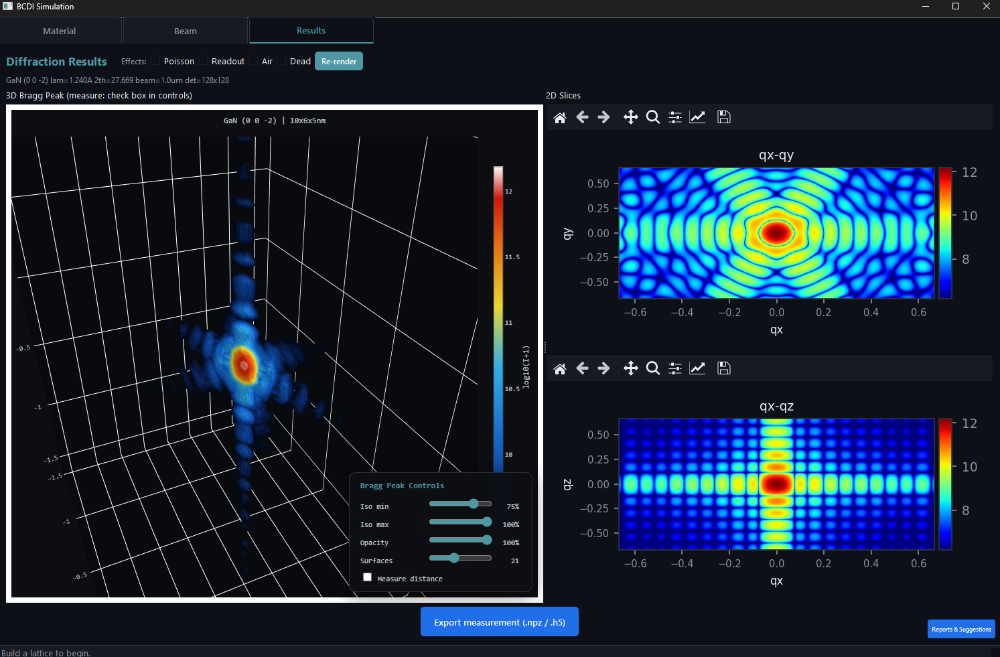

<div align="center">



# CDI-ST

**Coherent Diffraction Imaging — Simulation Tools**

An end-to-end Bragg Coherent Diffraction Imaging (BCDI) Python application using low computational resources with an easy to learn GUI:
crystal lattice construction, X-ray scattering simulation, neural-network phase retrieval,
and 3D visualization, in a single GUI.

[](https://pypi.org/project/cdi-stools/)
[](https://pypi.org/project/cdi-stools/)
[](https://opensource.org/licenses/MIT)
[]()

</div>

## Screenshots

<table>
  <tr>
    <td></td>
    <td></td>
  </tr>
  <tr>
    <td align="center"><sub>Launcher</sub></td>
    <td align="center"><sub>Material — crystal builder</sub></td>
  </tr>
  <tr>
    <td></td>
    <td></td>
  </tr>
  <tr>
    <td align="center"><sub>Results — simulated Bragg peak</sub></td>
    <td align="center"><sub>3D Viewer — reconstruction</sub></td>
  </tr>
</table>


---

## Installation

```bash
pip install cdi-stools
```

After installation, launch the GUI from any terminal:

```bash
cdi-st or cdi-stools
```

**Support for other beamlines files is coming in future updates...**


> **Note**: `cdi-st` ships a Qt-based GUI. On Linux, you may need system Qt
> dependencies (`sudo apt install libxcb-cursor0 libxkbcommon-x11-0` on Ubuntu/Debian).
> On Windows and macOS the wheel includes everything.

---

## What is BCDI?

Bragg Coherent Diffraction Imaging is a synchrotron technique that reconstructs the
3D shape and atomic-displacement field of nanocrystals by inverting the diffraction
intensity around a Bragg peak. The intensity gives only |F(q)|², so reconstruction
must recover the missing phase by iterative algorithms (HIO, RAAR, ER),
more recently by neural networks.

**CDI-ST integrates the entire workflow into one tool:**

| Step | What you do | Where in the GUI |
|---|---|---|
| 1. Build a crystal | Define material, shape, orientation, optional defects | **BCDI Simulation → Material** |
| 2. Set the X-ray geometry | Beam energy, detector geometry, oversampling | **BCDI Simulation → Beam** |
| 3. Simulate diffraction | Compute the 3D Bragg peak | **BCDI Simulation → Results** |
| 4. Generate training data | Build a labeled dataset of (object, diffraction) pairs | **BCDI Data Analysis → Generate Data** |
| 5. Train an unsupervised NN | AutoPhase_NN: physics-driven, no ground truth | **BCDI Data Analysis → AutoPhase_NN** |
| 6. Train a supervised NN | CDI_NN: PhaseUNet3D learning the phase mapping | **BCDI Data Analysis → CDI_NN** |
| 7. Reconstruct | NN → optionally refine with HIO/RAAR/ER | **BCDI Data Analysis → Reconstruction** |
| 8. Visualize and export | Interactive 3D viewer, ParaView VTI export | **BCDI Data Analysis → 3D Viewer** |

---

## The simulation pipeline

### 1. Material — build the crystal

Choose from preset materials (Si, Ge, Pt, Au, SiC, GaAs, ...) or import a custom
CIF file. The crystal is built atom-by-atom from the unit cell, replicated to the
requested supercell size.

You can:
- Select the **particle shape**: cube, sphere, cylinder, hexagonal prism, octahedron, dodecahedron
- Set the **target oversampling ratio** (controls how much of the diffraction
  volume the object occupies)
- Add **strain fields**: radial gradient, edge dislocation, random
- Add **dislocations**: edge / screw / mixed, at a configurable position with
  an arbitrary Burgers vector

The 3D lattice view (powered by Plotly) shows every atom in the supercell.

### 2. Beam — define the X-ray geometry

Select a reflection (h k l) from the auto-computed list of allowed peaks.
The Beam tab also lets you set:
- **Beam energy** (and the resulting wavelength)
- **Detector geometry**: pixel pitch, sample-to-detector distance, detector size
- **Beam size** in microns
- **Detector preset**: Maxipix (516×516), Eiger 2M, custom rectangular

Detector preset auto-fills the geometry parameters.

### 3. Results — run the simulation

CDI-ST computes the diffraction in **two paths**:

- **Analytical path** (cube/rectangular shapes, no strain): closed-form Fourier transform of the support
- **FFT path** (any shape, any strain field): full 3D FFT of the complex object

Output: 3D diffraction volume `|F(q)|²`, displayed as 2D slices (qx-qy, qx-qz)
and in an interactive 3D Plotly viewer with iso-surface controls.

You can export the simulation as a `.npz` file ready for the data-analysis side,
or for use as ground truth when training NNs.

---

## The data-analysis pipeline

### 4. Generate Data — create training samples

Generates a dataset of synthetic BCDI samples for NN training. Each sample
contains the ground-truth phase, support, and the simulated diffraction
intensity. You control:

- **Number of samples** (typically 2,000–10,000)
- **Grid size** (64³ recommended for training, 128³ for production inference)
- **Materials** (random or fixed)
- **Particle size variation** (random supercell multiplier)
- **Random dislocations** adds occasional edge/screw/mixed dislocations
- **Random strain** adds occasional radial/edge/random strain fields

Samples save as `sample_XXXXX.npz` and a `manifest.json`. Generation is
parallelizable and resumable.

### 5. AutoPhase_NN — unsupervised physics-driven NN

AutoPhase_NN is a 3D dual-decoder convolutional network that learns to invert the
Fourier modulus constraint **without ground truth**. It predicts the object's
amplitude and phase such that `|FFT(amp · exp(iφ))|` matches the measured
magnitude. The loss is a normalized-magnitude error plus optional regularizers
on phase smoothness and support compactness. This is the network from (Yao, Yudong, 
et al. npj Computational Materials 8.1 (2022) ) reimplemented for this codebase.

Training is GPU-accelerated (CUDA preferred) and converges in a few dozen
epochs on 2,000+ samples. The best checkpoint is saved automatically.

### 6. CDI_NN — supervised PhaseUNet3D

A 3D U-Net that predicts the phase field from the diffraction magnitude, trained
against the ground-truth phase from the data generator.

Use AutoPhase_NN when you don't trust your simulator's ground truth (or have
none). Use CDI_NN when you have a high-fidelity simulator and want a direct
mapping. Use both via the **ensemble** mode in the Reconstruction tab.

### 7. Reconstruction — invert experimental or simulated data

Load any `.npz` (simulated) or `.h5` (experimental) BCDI file, or convert a
SPEC + EDF scan from ID01 directly via the dialog. Choose:

- **NN-only**: forward pass, twin-image suppression, COM centering
- **Refined**: NN seed → HIO + RAAR + ER iterative phase retrieval
- **Ensemble**: AutoPhase_NN + CDI_NN combined, optionally refined
- **Compare**: runs both modes side-by-side

The output is a complex object (amplitude + phase), a binary support, the
R-factor convergence curve, and 2D slices at the COM of the reconstruction.

For experimental data, the loader handles:
- Detector chip-gap masking (Maxipix, Eiger)
- Hot-pixel removal
- Beamstop / direct-beam streak removal
- Bragg-peak-centered cropping
- Optional q-space orthogonalization via xrayutilities (with `[id01]` extra)

### 8. 3D Viewer — interactive visualization

The viewer renders the reconstruction in three modes:

- **Point cloud**: every voxel above threshold, colored by amplitude / phase / strain,
  with per-voxel opacity weighted by intensity
- **Isosurface**: smoothed iso-shell with internal data points showing through
- **Surface only**: bare iso-mesh with edges visible

Controls:
- Threshold (% of peak amplitude), voxel size, opacity, colormap
- Color scale auto / manual (`vmin` / `vmax`)
- Clip plane on any axis
- Mouse: left-drag rotate, right-drag pan, wheel zoom, double-click reset
- Export PNG snapshot or VTI (ParaView)

---

## Project structure

```
cdi-st/
├── src/cdi_st/
│   ├── __init__.py
│   ├── __main__.py              # python -m cdi_st
│   ├── bcdi_gui.py              # main entry point + launcher + splash
│   ├── bcdi_core.py             # crystal builder, simulator, reflection calculator
│   ├── nn_gui_tabs.py           # all NN-related GUI tabs
│   ├── nn_data_generator.py     # training-data generator
│   ├── nn_dataset.py            # PyTorch Dataset wrapper
│   ├── nn_phase_model.py        # PhaseUNet3D (supervised)
│   ├── nn_autophase_model.py    # AutoPhaseNet3D (unsupervised)
│   ├── nn_train.py              # supervised training CLI
│   ├── nn_autophase_train.py    # unsupervised training CLI
│   ├── nn_phase_retrieval.py    # HIO / RAAR / ER iterative algorithms
│   ├── nn_autophase_infer.py    # inference: nn_only / refined / ensemble
│   ├── nn_experimental_loader.py # h5/spec/edf loading + preprocessing
│   ├── nn_demo.py
│   ├── nn_visualize.py
│   └── CDI_ST_logo.png
├── tests/
├── docs/
├── pyproject.toml
├── README.md
├── LICENSE
└── CHANGELOG.md
```

---

## Citing

If you use CDI-ST in published research, please cite:

```bibtex
@software{saidi_cdi_st_2026,
  author       = {Saidi, Soufiane},
  title        = {CDI-ST: Coherent Diffraction Imaging — Simulation Tools},
  year         = {2026},
  publisher    = {GitHub},
  url          = {https://github.com/Refze/CDI-St}
}
```

---

## License

MIT — see [LICENSE](LICENSE).

## Author

**Soufiane SAIDI** — saidisoufiane@hotmail.com

We heavily encourage you to use the in-app **Reports & Suggestions** button to send any type of feedback.

---

## Acknowledgments

Built on the shoulders of the BCDI and python community:
[PyNX](https://pynx.esrf.fr/), [BCDI-Utilities](https://github.com/carnisj/bcdi),
[cdiutils](https://github.com/clatlan/cdiutils), [xrayutilities](https://xrayutilities.sourceforge.io/),
[scikit-image](https://scikit-image.org/), [PyQt6](https://www.riverbankcomputing.com/software/pyqt/),
and the AutoPhaseNN paper by Yao et al. (2022).
